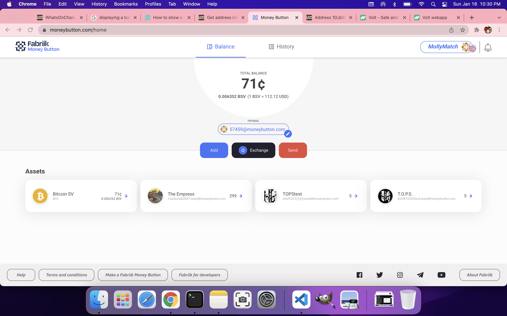
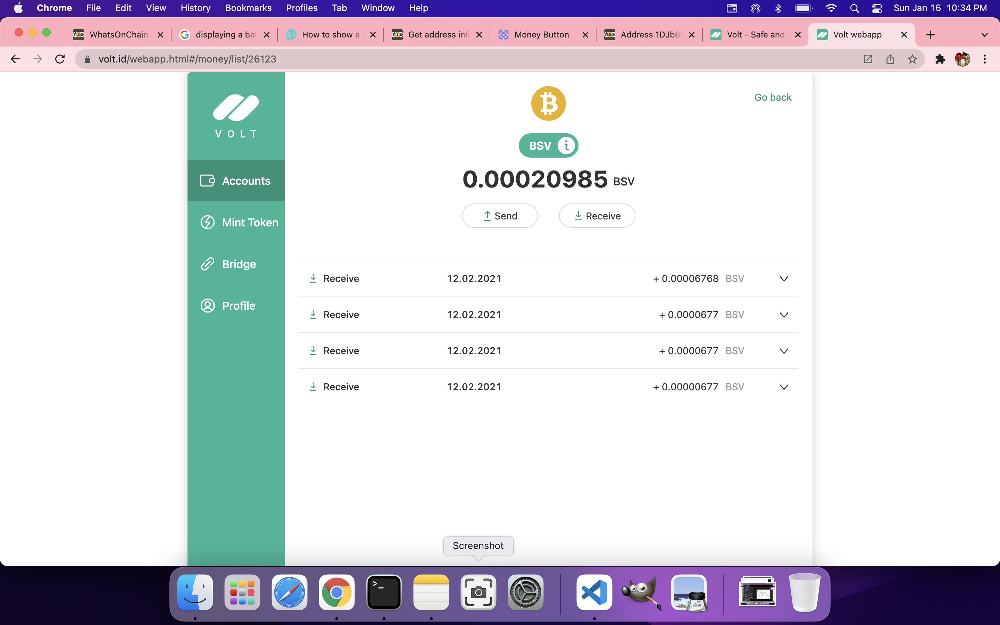
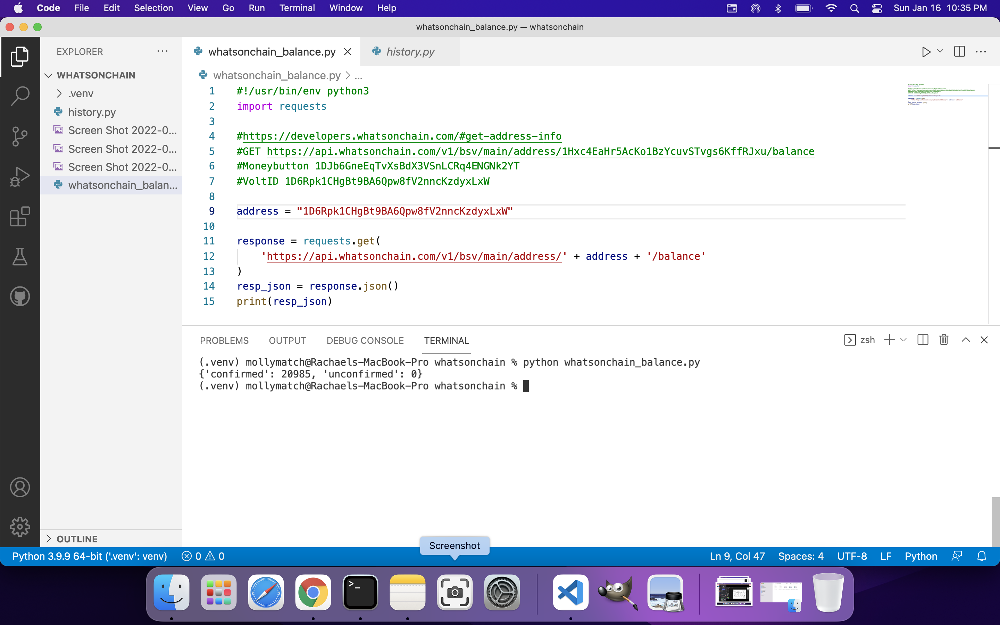
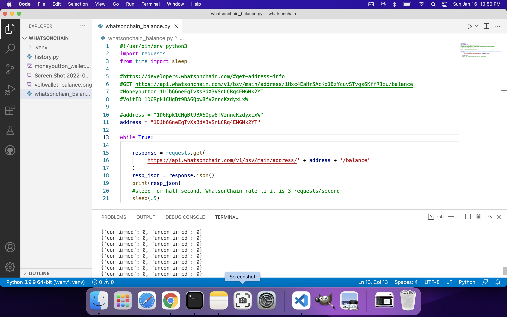

# whatsonchain balance python script
A short python script to check your wallet balance.  I added a couple from Moneybutton, Volt.Id and HandCash.  Moneybutton and HandCash use rolling addresses.  When running whatsonchain_balance.py you will receieve a zero balance for HandCash and Moneybutton. 

WhatsOnChain has a rate limit of 3 requests/second. Line 15 is a loop to keep checking the wallet balance every .5 seconds. This can be useful while you send and receive money to the wallet address. 
[WhatsOnChain Rate Limits](https://developers.whatsonchain.com/#rate-limits)
[WhatsOnChain Get Balance](https://developers.whatsonchain.com/#get-balance)

Example of balance in a Moneybutton Wallet

Example of balance of Volt.Id wallet

Script ran to show positive balance of Volt.Id Wallet.

Script ran to show "negative" balance of my Moneybutton wallet. Moneybutton has multiple legacy addresses. 
